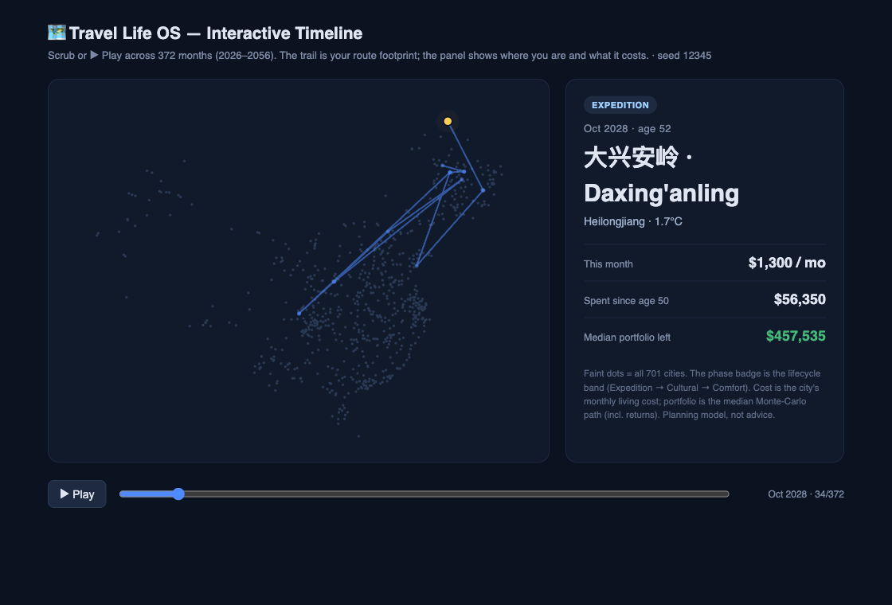

# 🌍 Travel Life OS v4.1

**Deterministic geo-life planning + financial-constraint engine for China (ages 50–80).**

A constrained life-trajectory optimizer — *not* a travel planner. It loads **700 real cities** (every prefecture seat + the largest county seats), scores each on medical / climate / altitude risk, walks a weighted city graph year by year under an **age-band lifecycle matrix** (frontier expeditions → cultural interior → comfort coasts), runs a Monte Carlo drawdown of a US$500k portfolio coupled with **housing, healthcare, and tax**, and emits a **month-by-month residence calendar** you can import as `.ics`. It answers the questions that decide everything:

> **Does the money last to 80 — which life strategy survives best — and where should I physically be each month?**

**🔴 Live demo — opens on any phone:** **<https://alexmorerich.github.io/travelos-demo/>**

*English · [中文](#-中文文档)*

---

## ⚡ Headline results (default config · 700 cities · 2,000 MC paths)

### The routing lever — survival is dominated by spend rate, not itinerary polish

Same safety gates, same finance model. The *only* change is how much you pay for experience:

| Routing objective | Survival to 80 | Mean spend | Median bankruptcy |
|---|---:|---:|---:|
| **Cost-minimized** | **77.6%** | $12,674/yr | — |
| Balanced | 45.5% | $18,078/yr | 78 |
| Experience-optimized | 25.9% | $21,722/yr | 72 |

Switching the routing objective moves survival **25.9% → 77.6%**. That single table is the thesis: the lever is cost, not polish.

### The 30-year lifecycle matrix — entropy shifts with age

Routing is **not** uniform across the 30 years. An age-band matrix (`config/age_bands.json`) shifts *where* you go — from high-energy frontier expeditions early to climate-stable, hospital-rich coasts late — and raises the weight on climate comfort (18–25°C) and tier-3A hospital access as you age:

| Age band | Phase | Target zones | Realized frontier share |
|---|---|---|---:|
| **50–60** | **Expedition** | Xinjiang · Tibet · Inner Mongolia · Heilongjiang | **~70%** |
| **60–70** | **Cultural deep-dive** | Yunnan · Guizhou · Shaanxi · Sichuan | ~0% |
| **70–80** | **Climate & comfort** | Fujian · Guangdong · Hainan · Zhejiang | 0% |

Each year the traveller makes **one long-haul migration** into the band's target zone, then explores a tight local cluster; a **quarterly comfort audit** flags any quarter outside 18–25°C. (Full operating model: [The 30-year roadmap](#-the-30-year-roadmap--quarter-agent-operating-model).)

### The v4.1 strategy selector — coupled housing + healthcare + tax

Full cost reality (age-rising healthcare + tax drag + rent-vs-buy), ranked by survival of **liquid** capital:

| Strategy | Survival to 80 | Median net worth | Owns home |
|---|---:|---:|---:|
| 🏆 **Nomad · frugal** | **36.4%** | $0 | — |
| Offshore + frugal + settle Chengdu | 13.8% | $227k | ✅ |
| Buy & settle · Daya Bay | 9.4% | $164k | ✅ |
| Nomad · experience | 9.1% | $0 | — |
| Buy & settle · Chengdu | 5.0% | $227k | ✅ |

**Three honest findings the engine surfaces:** (1) healthcare alone roughly *halves* survival (frugal drops 77.6% rent-only → 36.4% once medical + tax are modeled); (2) buying a home late after drawdown wrecks liquid survival but floors net worth; (3) the robust play is frugal + offshore.

### The time layer — a seasonal residence calendar

Each year is split into 12 months and each month placed in its most comfortable city, producing a **snowbird pattern** — e.g. at age 60: winter in **Xiamen (14.5°C)**, summer inland. Exported as `schedule.json`, a quarterly rollup, and an importable **`schedule.ics`**.



> ⭐ **`open outputs/timeline.html`** — scrub or ▶ Play across all 372 months; the blue trail is your route footprint, the phase badge is the lifecycle band (above: Oct 2028, age 52 — **Expedition** phase, Daxing'anling in the far-northeast frontier; $1,300/mo, $56k spent, $458k left).

> Planning model, **not financial advice.** Non-geographic fields are rule-based estimates (see [Data honesty](#data-honesty)).

---

## 🧭 The 30-year roadmap & Quarter-Agent operating model

The engine encodes a **Lifecycle Optimization** view: shift "entropy" from high-energy expeditions (early) to high-comfort, climate-stable environments (late). The matrix is enforced in routing; the model below is how you *operate* it over time.

### The optimization matrix

| Age band | Project focus | Primary target zones | Priority metric |
|---|---|---|---|
| **50–60** | Expedition phase | Frontier provinces (Xinjiang, Tibet, Inner Mongolia, Heilongjiang) | Physical stamina & novelty |
| **60–70** | Cultural / deep dive | Interior & historical hubs (Yunnan, Guizhou, Shaanxi, Sichuan) | Cognitive depth & history |
| **70–80+** | Climate / comfort | Coastal & southern, medical hubs (Fujian, Guangdong, Hainan) | Temperature & healthcare access |

In code, `config/age_bands.json` gives each band a **zone bonus** (favour target provinces), a **comfort bonus** (18–25°C fit), and a **hospital bonus** (tier-3A access) — the last two rise with age, encoding the *Frontier → Infrastructure* shift. Each simulated year migrates into the zone, then clusters locally (low-entropy travel).

### Operating it: "Quarter Agents" (a 90-day audit loop)

Rather than a fixed plan, re-audit every quarter. Three prompts to drive a quarterly agent — each mirrored by something the engine already emits:

1. **Entropy audit** — *"Review the next quarter's cities against 10-yr temperature & air-quality norms; keep 18–25°C; swap anything past the comfort threshold for my age."* → `schedule.json` quarters carry a `comfort_ok` flag to seed exactly this check.
2. **Health-risk calibration** — *"At age [X], shift the Frontier-vs-Infrastructure ratio: raise the density of Tier-1/2 cities with strong hospital access in the 3-year plan; keep ~20% on rural discovery."* → mirrors the band `hospital_bonus` ramp + the county-seat (rural) share.
3. **Low-entropy protocol** — *"Plan a 3-city cluster that minimizes transit (direct HSR / airport proximity), no multi-leg days, ≥3 days residency per city."* → mirrors the per-year local cluster + whole-month stays.

### The warm-up (ages 44–50)

A 6-year "pre-game" before the simulation starts: (a) **build the backend** — the 700-city digital twin + data pipeline (done — `npm run anchors`), and (b) **field-test logistics** on near-term trips (e.g. with parents); if a transit route is too complex, flag it *High-Entropy* and pull it from your 70s into your 50s.

---

## 📖 Beginner's tutorial

New here? This explains **what the system does, the ideas behind it, and how to use it** — no finance or coding background needed.

### What problem does it solve?

Imagine planning the second half of life (ages **50–80**) as someone who can live anywhere in China. Three things pull against each other:

- **Health & safety** — as you age you want to stay near good hospitals and avoid harsh climates / high altitude.
- **Experience & comfort** — you'd like interesting, pleasant places.
- **Money** — a fixed pot (default **$500,000**) must last ~30 years.

This tool plays out all 30 years, **month by month**, and shows you **where to live each month, what it costs, and whether the money lasts.**

### The big idea

It loads **700 real Chinese cities**, scores each on risk, walks a year-by-year path that respects your aging health, then runs **thousands of simulated futures** to estimate the odds your savings survive to 80. Same inputs → same outputs, every time (fully deterministic).

### Key concepts (plain English)

| Concept | In one sentence |
|---|---|
| **R_age** (health factor) | A number from 1.0 (robust) down to 0.35 (fragile) that shrinks with age — older means travel less and avoid risk more. |
| **TREI** (risk score) | "How risky is this city for me *right now*?" — combines hospital distance, climate, and altitude, scaled by your age. Lower = safer. |
| **The safety gate** | Hard rules that can't be broken: no city >2 h from a top (tier-3A) hospital; after 70, nothing above 2,500 m. Everything else is *ranked*, not banned. |
| **Routing** | Each year it picks a few cities by value-for-money (nice + safe + affordable). Older = fewer cities, until you settle in one place. |
| **Snowbird schedule** | Within each year, the 12 months go to the most comfortable city for that season (warm south in winter, cooler places in summer). |
| **Monte Carlo + survival %** | Markets are uncertain, so it simulates 2,000 possible futures (good years, crashes, recessions) and reports the **% where your money lasts to 80** — the headline number. |
| **Strategies** | It compares life plans (keep moving vs. buy a home and settle; onshore vs. offshore money) and ranks them by survival. |

### Your first run (3 steps)

> **Just want to look?** Open the **[live demo](https://alexmorerich.github.io/travelos-demo/)** on your phone — no install needed. To run and customize it yourself:

```bash
git clone https://github.com/alexmorerich/travelOS && cd travelOS
npm install
npm run anchors && npm run enrich && npm run simulate
```

Then open the results:

- **`outputs/timeline.html`** — the ⭐ interactive demo: drag the slider (or press ▶ Play) to move through 30 years and watch your route + cost unfold.
- **`outputs/dashboard.html`** — the survival probability, the "frugal vs. fancy" comparison, and the seasonal calendar.
- **`outputs/schedule.ics`** — import into your phone / Google Calendar to see the plan as real calendar events.

### Reading the interactive timeline

As you scrub: the **blue trail** is your route so far (your "footprint"), the **yellow dot** is where you are that month, and the panel shows the **city, month, age, monthly cost, total spent, and money left.** When "money left" turns orange/red, the plan is running low.

### Make it about *you*

Everything lives in `config/` — edit a value and re-run `npm run simulate`:

- **Start city / age range / start year** → `config/system_config.json` (`base_city`, `age_start`, `age_end`, `base_calendar_year`)
- **Your money** → `config/finance.json` (`initial_portfolio_usd` + return assumptions)
- **Fancy vs. frugal** → `config/routing_profiles.json` (default is "experience"; "frugal" spends far less)
- **Buy a home? Insurance? Offshore?** → `config/strategies.json`

### FAQ

- **Is this financial advice?** No — it's a planning model with illustrative assumptions. It never trades or touches real money.
- **Are the city numbers real?** Coordinates and altitude are real (GeoNames). Hospital time, climate, and cost are *rule-based estimates* — good for exploring, not gospel.
- **Why 700 cities?** Every prefecture seat (~290) plus the largest county seats from GeoNames. The pipeline scales further toward ~2,800 counties by relaxing the population cut.
- **The survival % looks low!** That's the point — it shows **spending is the biggest lever.** Try the `frugal` profile and watch it jump from ~26% to ~78%.

---

## 🚀 Quickstart

```bash
npm install
npm run anchors         # download GeoNames -> data/city_anchors.json (700 cities) [needs python3 + network]
npm run enrich          # anchors -> data/cities_china.json (rule-based estimates)
npm run simulate        # full pipeline -> outputs/ (routing + scenarios + v4.1 + schedule)
open outputs/timeline.html  # ⭐ interactive map: scrub the route, see city + cost month-by-month
open outputs/dashboard.html
open outputs/schedule.ics   # import the 30-year residence calendar

npm run db              # optional: D1-compatible SQLite (cities, edges, plans, scenarios, strategies, schedule)
npm run typecheck
```

Node ≥ 20; `npm run anchors` needs python3 + network (the committed dataset already includes its output, so you can skip it). Core sim has **no native dependencies**; `better-sqlite3` is optional (only `npm run db`).

---

## 🧭 Pipeline

```
GeoNames ─▶ anchors ─▶ enrich ─▶ load ─▶ validate ─▶ weighted graph ─▶ TREI risk
   ─▶ routing walk (age 50→80) ─┬─▶ primary plan + dashboard + Obsidian
                                ├─▶ Task 1: routing-profile comparison
                                ├─▶ v4.1: coupled strategy selector (housing+healthcare+tax)
                                └─▶ time layer: monthly schedule + quarters + .ics
   ─▶ Monte Carlo drawdown ─▶ survival probability
```

Everything is **deterministic**: a given `(dataset, seed)` reproduces bit-for-bit.

---

## 🏗️ Architecture

```
travelOS/
├── config/
│   ├── system_config.json       # seed, age range, base city, radius, base_calendar_year
│   ├── normalization.json       # the 0–10 risk curves
│   ├── thresholds.json          # hybrid gate (percentile + hospital/altitude)
│   ├── finance.json             # Monte Carlo return regimes
│   ├── routing_profiles.json    # experience / balanced / frugal (Task 1)
│   └── strategies.json          # v4.1 housing + healthcare + tax + strategies
├── data/
│   ├── city_anchors.json        # 700 cities: REAL geo + curated tags (from GeoNames)
│   └── cities_china.json        # GENERATED by `npm run enrich`
├── scripts/
│   └── build_anchors_from_geonames.py   # the real admin-division ingest (npm run anchors)
├── database/schema.sql          # D1-compatible relational schema
├── src/
│   ├── data_pipeline/{enrich_estimates,fetch_china_admin_divisions}.ts
│   ├── core_engine/
│   │   ├── trei_engine.ts        # normalization + env_risk + R_age + TREI
│   │   ├── constraint_engine.ts  # hybrid absolute + percentile gate
│   │   ├── routing_engine.ts     # yearly greedy graph walk (profile-weighted)
│   │   ├── lifecycle_engine.ts   # 30-year loop, state carry
│   │   ├── finance_engine.ts     # Monte Carlo drawdown (+ v4.1 coupling hooks)
│   │   └── climate_engine.ts     # seasonal monthly-temperature model
│   ├── simulation_engine/
│   │   ├── scenario_runner.ts    # Task 1: routing-profile comparison
│   │   └── monthly_scheduler.ts  # time layer: months -> cities + .ics
│   ├── v41/{housing,healthcare,tax,strategy}_engine.ts
│   ├── graph_layer/ · data_layer/ · dashboard/ · lib/ · scripts/
│   └── config.ts · types.ts · index.ts
└── outputs/                      # generated artifacts
```

---

## 🔬 The engine, exactly

### Risk normalization (`config/normalization.json`)

| Sub-score | Mapping |
|---|---|
| `altitude_score` | piecewise: flat ≤500m, ramps through the 1500–3500m hypoxia band to 10 |
| `climate_variance_score` | linear: annual temp range 10°C→0 … 45°C→10 |
| `humidity_score` | `\|humidity − 50\| / 5`, clamped 0–10 |
| `medical_risk` | linear: minutes to tier-3A, 0→0 … 150→10 |

```
env_risk = 0.4·altitude + 0.3·climate + 0.3·humidity   (missing input ⇒ +penalty, flag PARTIAL)
R_age    = clamp(1 − ((age−40)/40)^1.5, 0.35, 1.0)      (NaN-safe; 50→0.875, 80→0.35)
TREI     = (env_risk · medical_risk) / (R_age · 10)
```

### Hybrid feasibility gate

```
BLOCKED       hospital > 120 min  OR hospital unknown
BLOCKED       age > 70 AND altitude > 2500m   (unknown altitude ⇒ unsafe)
LOW_PRIORITY  TREI > percentile_85(feasible set this year)
ALLOWED       otherwise
```

### Routing — a profile-weighted graph walk

```
utility = culture_pursuit·culture/(TREI+eps) − cost_weight·(monthly_cost/1000) − travel_weight·(dist/1000)
```

Three profiles (`config/routing_profiles.json`) change those weights; `frugal` cranks `cost_weight` and drops `culture_pursuit`. Cities-per-year = `round(4·R_age)`, so itineraries collapse from ~4 cities at 50 to single-city stabilization by 70.

### Finance — Monte Carlo drawdown (real USD)

```
portfolio(t+1) = portfolio(t)·(1 + real_return − tax_drag) − living − healthcare(age) − lump(age)
real_return ~ N(3.5%, 11%) normally / N(−18%, 10%) in a recession year (p=10%)
```

Thousands of seeded paths → survival, median bankruptcy age, p10/50/90 trajectories, terminal net worth (liquid + owned home).

### v4.1 coupling

- **Housing**: a *buy* strategy converts liquid cash to an illiquid home at `buy_age`, replacing rent with ownership cost.
- **Healthcare**: OOP cost rises ~6%/yr with a rising-probability tail; insurance dampens it for a premium. Drawn inside the MC.
- **Tax**: onshore vs offshore (HK/SG) return drag.
- **Strategy selector**: runs the full coupled MC per strategy and ranks by survival.

### Seasonal climate + scheduling

```
mean(lat,alt)  = 28 − 0.7·(|lat|−18) − 0.0065·alt
amplitude(lat) = 6 + 0.45·(|lat|−18)
temp(month)    = mean − amplitude·cos(2π·(month−1)/12)     (Jan coldest, Jul warmest)
```

The scheduler keeps each year's day counts (so cost is unchanged) and assigns the **hardest months first** to their most comfortable city — yielding a snowbird calendar when the year's cities allow it. Exported to `schedule.json` (+ quarters) and `schedule.ics`.

---

## 📊 Outputs (`outputs/`)

| File | Contents |
|---|---|
| `yearly_plan.json` | 31 yearly plans (primary profile) |
| `full_30_year_route.json` | compressed life-phase narrative |
| `cashflow_report.json` | primary survival probability + p10/50/90 trajectories |
| `scenario_comparison.json` | **Task 1** — survival per routing profile |
| `strategy_comparison.json` | **v4.1** — survival per coupled life-strategy, ranked |
| `schedule.json` | **time layer** — month-by-month residence + quarters |
| `schedule.ics` | importable 30-year residence calendar |
| `risk_heatmap.json` | per-city TREI + decision at representative ages |
| `edges.json` | the weighted city graph (24,071 edges) |
| `invalid_nodes_report.json` | data-quality audit |
| `timeline.html` | **interactive demo** — scrub/play the 30-year route on a China map; live city, monthly cost, total spent, portfolio left |
| `dashboard.html` | self-contained dashboard: comparisons, survival curve, TREI histogram, seasonal calendar, route |
| `obsidian/` | linked vault — overview + one note per year (with monthly schedule) |
| `travel_os.db` | SQLite (D1-compatible): cities, edges, plans, scenarios, strategies, schedule |

---

## ⚙️ Tuning

- **Routing objectives** — `config/routing_profiles.json`.
- **Lifecycle matrix** — `config/age_bands.json` (target zones, comfort/hospital weights, comfort band per age band).
- **Strategies / housing / healthcare / tax** — `config/strategies.json`.
- **Risk curves / gate** — `config/normalization.json`, `config/thresholds.json`.
- **Returns** — `config/finance.json`.
- **The person / start year** — `config/system_config.json` (`base_city`, `age_start/end`, `base_calendar_year`, `seed`).

---

## 📈 Scaling toward 2,800 counties

The dataset is built by `npm run anchors` from GeoNames (PPLC/PPLA/PPLA2/PPLA3 seats → top ~700 by population). To go further:

1. Raise the `TARGET` in `scripts/build_anchors_from_geonames.py` (or ingest NBS division codes) → up to ~2,800 county nodes; the enricher and engine are size-agnostic.
2. Graph is O(n²) within `radius_km` — fine to a few thousand nodes in SQLite; beyond that persist `edges` to D1.
3. Replace rule-based estimates with measured data (Amap/OSRM hospital travel-time, climate normals); keep the `source` tags so approximations stay visible.

---

## 🧪 Design decisions (resolved across the v3.x → v4.1 review cycle)

- **No coverage collapse** — percentile + absolute hybrid gate.
- **Consistent units** — normalized 0–10 sub-scores, no raw `max()`.
- **No silent null optimism** — missing data → penalty + PARTIAL/BLOCK.
- **Real routing** — graph walk with a visited-set and a start location.
- **Honest money** — Monte Carlo with sequence-of-returns risk, coupled to housing/healthcare/tax.
- **Real data, real mess** — GeoNames ingest exposed (and the pipeline fixes) missing capitals, `-9999` elevation, and noisy names.
- **No fake precision** — great-circle travel times and a seasonal climate model, both explicitly tagged.

### Data honesty

`lat`, `lng`, `altitude_m` come from **GeoNames** (CC BY). `tier3_hospital_minutes`, `avg_temp_range`, `humidity_index`, `monthly_cost_usd`, `cultural_value`, and monthly temperatures are **rule-based estimates** — good enough to exercise the engine, not authoritative. Replace via the data pipeline before treating any specific city result as real.

## 🗺️ Roadmap (v4.2)

Season-aware *routing* (pick the year's cities for complementary seasons, not just place them), buy-age sweep, dynamic spend, and a measured hospital-travel-time ingest.

## License

MIT © 2026 alexmorerich · city data © GeoNames (CC BY 4.0)

---
---

# 🌏 中文文档

# 🌍 Travel Life OS v4.1（旅居人生操作系统）

**面向中国、覆盖 50–80 岁的确定性「地理-人生」规划 + 金融约束引擎。**

**🔴 在线演示——手机即可打开：** **<https://alexmorerich.github.io/travelos-demo/>**

这不是旅行规划器，而是**带约束的人生轨迹优化器**。它加载 **700 座真实城市**（全部地级市 + 主要县城），对每座城市的医疗 / 气候 / 海拔风险打分，在**年龄分段生命周期矩阵**（边疆探险→文化腹地→舒适沿海）下逐年在加权城市图上行走，对 50 万美元资产组合做耦合**住房、医疗、税务**的蒙特卡洛消耗模拟，并输出可导入 `.ics` 的**逐月居住日历**。它回答那些决定一切的问题：

> **钱能撑到 80 岁吗？哪种人生策略存活率最高？每个月该待在哪里？**

## ⚡ 核心结论（默认配置 · 700 城 · 2000 条路径）

### 路由杠杆——存活率由支出水平主导，而非行程精细度

| 路由目标 | 撑到 80 岁 | 平均支出 | 中位破产年龄 |
|---|---:|---:|---:|
| **成本最小化** | **77.6%** | $12,674/年 | — |
| 平衡 | 45.5% | $18,078/年 | 78 |
| 体验优先 | 25.9% | $21,722/年 | 72 |

仅切换路由目标，存活率从 **25.9% → 77.6%**。杠杆是成本，不是精细度。

### 30 年生命周期矩阵——熵随年龄迁移

路由并非 30 年一致。年龄分段矩阵（`config/age_bands.json`）把**去哪**从早年高能边疆探险，迁移到晚年气候稳定、医疗密集的沿海——并随年龄提高对气候舒适（18–25°C）与三甲医院可达性的权重：

| 年龄段 | 阶段 | 目标区域 | 实测边疆占比 |
|---|---|---|---:|
| **50–60** | **探险** | 新疆 · 西藏 · 内蒙古 · 黑龙江 | **~70%** |
| **60–70** | **文化深潜** | 云南 · 贵州 · 陕西 · 四川 | ~0% |
| **70–80** | **气候与舒适** | 福建 · 广东 · 海南 · 浙江 | 0% |

每年做**一次长途迁徙**进入目标区域，再就地紧凑探索；**季度舒适审计**会标记任何超出 18–25°C 的季度（完整操作模型见下文「30 年路线图」一节）。

### v4.1 策略选择器——耦合住房 + 医疗 + 税务

按**流动资本**存活率排序：

| 策略 | 撑到 80 岁 | 中位净资产 | 拥有住房 |
|---|---:|---:|---:|
| 🏆 **游牧 · 节俭** | **36.4%** | $0 | — |
| 离岸 + 节俭 + 定居成都 | 13.8% | $227k | ✅ |
| 买房定居 · 大亚湾 | 9.4% | $164k | ✅ |
| 游牧 · 体验 | 9.1% | $0 | — |
| 买房定居 · 成都 | 5.0% | $227k | ✅ |

**三个诚实发现：**（1）仅医疗一项就让存活率**腰斩**（节俭从仅租房 77.6% 降到 36.4%）；（2）消耗多年后才在 66 岁买房会摧毁流动存活率，但托住净资产；（3）稳健打法是节俭 + 离岸。

### 时间层——季节性居住日历

每年拆成 12 个月，每月安置到最舒适的城市，形成**候鸟模式**——如 60 岁：冬季在**厦门（14.5°C）**，夏季转内陆。导出为 `schedule.json`、季度汇总，以及可导入的 **`schedule.ics`**。

> 规划模型，**不构成投资建议**。非地理字段为规则化估算（见[数据诚实性](#数据诚实性-1)）。

## 🧭 30 年路线图与「季度智能体」操作模型

引擎采用**生命周期优化**视角：把"熵"从早年的高能探险，迁移到晚年高舒适、气候稳定的环境。矩阵已写入路由；下面是你随时间**操作**它的方式。

### 优化矩阵

| 年龄段 | 项目重心 | 主要目标区域 | 优先指标 |
|---|---|---|---|
| **50–60** | 探险阶段 | 边疆省份（新疆、西藏、内蒙古、黑龙江） | 体能与新奇 |
| **60–70** | 文化/深潜 | 内陆与历史枢纽（云南、贵州、陕西、四川） | 认知深度与历史 |
| **70–80+** | 气候/舒适 | 沿海与南方、医疗枢纽（福建、广东、海南） | 温度与医疗可达 |

代码中 `config/age_bands.json` 为每段设定**区域加成**（偏好目标省份）、**舒适加成**（18–25°C 契合）、**医院加成**（三甲可达）——后两者随年龄上升，编码「边疆→基础设施」的转移。每个模拟年先迁入区域，再就地聚簇（低熵出行）。

### 操作：「季度智能体」（90 天审计循环）

不做固定计划，每季度重审。三条驱动季度智能体的提示——每条都对应引擎已产出的东西：

1. **熵审计**——*"用 10 年气温与空气质量常年值复核下季度城市；保持 18–25°C；超出我年龄舒适阈值的就替换。"* → `schedule.json` 的季度带 `comfort_ok` 标志。
2. **健康风险校准**——*"在 [X] 岁，调整'边疆 vs 基础设施'比例：提高 3 年计划中高医院可达的一二线城市密度；保留约 20% 乡村发现。"* → 对应 `hospital_bonus` 爬升 + 县城占比。
3. **低熵协议**——*"规划最小化中转的 3 城聚簇（直达高铁/邻近机场），无多程日，每城 ≥3 天停留。"* → 对应每年本地聚簇 + 整月停留。

### 热身期（44–50 岁）

模拟开始前的 6 年"预备期"：（a）**搭建后端**——700 城数字孪生 + 数据管线（已完成 `npm run anchors`）；（b）在近期行程（如与父母同行）**实测物流**；若某条中转过于复杂，标记为「高熵」并从 70 多岁提前到 50 多岁。

---

## 📖 新手教程

第一次接触？本节用大白话讲清**它做什么、背后的思路、怎么用**——无需金融或编程基础。

### 它解决什么问题

设想你规划下半生（**50–80 岁**），可在中国任意城市旅居。三股力量相互拉扯：**健康与安全**（年长后想靠近好医院、避开极端气候/高海拔）、**体验与舒适**、**钱**（默认 **50 万美元**要撑约 30 年）。本工具逐月推演 30 年，告诉你**每月住哪、花多少、钱够不够撑到 80。**

### 核心概念（大白话）

| 概念 | 一句话 |
|---|---|
| **R_age**（健康因子） | 1.0（硬朗）→ 0.35（脆弱），随年龄下降——越老越少折腾、更避险。 |
| **TREI**（风险分） | “这座城市现在对我多危险？”综合医院距离、气候、海拔，并按年龄缩放。越低越安全。 |
| **安全门控** | 硬规则：三甲医院 2 小时外不去；70 岁后海拔 >2500m 不去。其余只排序、不禁止。 |
| **路由** | 每年按“性价比”（好玩+安全+便宜）选几座城；越老越少，最终定居一城。 |
| **候鸟排程** | 每年 12 个月放到当季最舒适的城市（冬南夏凉）。 |
| **蒙特卡洛 + 存活率** | 市场不确定，模拟 2000 种未来（牛市、崩盘、衰退），报告“钱撑到 80”的百分比——头号数字。 |
| **策略** | 比较人生方案（一直游牧 vs 买房定居；在岸 vs 离岸），按存活率排序。 |

### 三步上手

> **只想看看？** 用手机打开 **[在线演示](https://alexmorerich.github.io/travelos-demo/)**，无需安装。想自己运行并定制：

```bash
git clone https://github.com/alexmorerich/travelOS && cd travelOS
npm install
npm run anchors && npm run enrich && npm run simulate
```

然后打开：**`outputs/timeline.html`**（⭐ 交互演示，拖动滑块或 ▶ 播放，看路线+花费随 30 年展开）、**`outputs/dashboard.html`**（存活率、节俭vs奢华对比、季节日历）、**`outputs/schedule.ics`**（导入手机/谷歌日历）。

### 看交互时间轴

拖动时：**蓝色轨迹**是你的路线足迹，**黄点**是当月所在城市，面板显示**城市、月份、年龄、月度花费、累计支出、剩余资产**。当“剩余资产”变橙/红，说明计划吃紧。

### 改成你自己的

编辑 `config/` 后重跑 `npm run simulate`：起点城市/年龄/起始年（`system_config.json`）、本金与收益假设（`finance.json`）、奢华还是节俭（`routing_profiles.json`）、买房/保险/离岸（`strategies.json`）。

### 常见问题

- **算投资建议吗？** 不是，是带示意假设的规划模型，从不交易真钱。
- **城市数据真实吗？** 经纬度/海拔来自 GeoNames（真实）；医院时间/气候/成本为规则化估算。
- **为何 700 城？** 全部地级市（约 290）加 GeoNames 中人口最多的县城；放宽人口阈值可继续扩展到 ~2800 县。
- **存活率好低！** 这正是重点——**支出是最大杠杆**，试试 `frugal` profile，看它从约 26% 飙到约 78%。

---

## 🚀 快速开始

```bash
npm install
npm run anchors         # 下载 GeoNames -> data/city_anchors.json（700 城）[需 python3 + 网络]
npm run enrich          # 锚点 -> data/cities_china.json（规则化估算）
npm run simulate        # 完整管线 -> outputs/（路由 + 场景 + v4.1 + 日历）
open outputs/timeline.html  # ⭐ 交互式地图：拖动时间轴，逐月查看城市与花费
open outputs/dashboard.html
open outputs/schedule.ics   # 导入 30 年居住日历

npm run db              # 可选：D1 兼容 SQLite（城市/边/计划/场景/策略/日历）
npm run typecheck
```

Node ≥ 20；`npm run anchors` 需 python3 + 网络（仓库已含其输出，可跳过）。核心模拟**无原生依赖**；`better-sqlite3` 可选。

## 🔬 引擎细节

### 风险归一化（`config/normalization.json`）

```
env_risk = 0.4·海拔 + 0.3·气候 + 0.3·湿度   （缺输入 ⇒ +惩罚，标记 PARTIAL）
R_age    = clamp(1 − ((age−40)/40)^1.5, 0.35, 1.0)
TREI     = (env_risk · medical_risk) / (R_age · 10)
```

### 混合可行性门控

```
BLOCKED       医院 > 120 分钟 或 未知
BLOCKED       年龄 > 70 且 海拔 > 2500m（海拔未知 ⇒ 不安全）
LOW_PRIORITY  TREI > 当年可行集合 85 百分位
ALLOWED       其他
```

### 路由——按 profile 加权的图行走

```
utility = culture_pursuit·culture/(TREI+eps) − cost_weight·(月成本/1000) − travel_weight·(距离/1000)
```

三个 profile（experience/balanced/frugal）改这些权重；`frugal` 拉高成本权重、压低文化追求。每年城市数 = `round(4·R_age)`。

### 金融——蒙特卡洛消耗（实际美元）

```
组合(t+1) = 组合(t)·(1 + 实际收益 − 税务拖累) − 生活 − 医疗(age) − 一次性(age)
实际收益 ~ N(3.5%, 11%) 正常 / N(−18%, 10%) 衰退年（p=10%）
```

### v4.1 耦合

- **住房**：买房策略在 `buy_age` 将现金转为非流动住房，以持有成本替代房租。
- **医疗**：自付随龄约 6%/年上升，含概率渐增尾部事件；保险换尾部减免。
- **税务**：在岸 vs 离岸（港/新）收益拖累。
- **策略选择器**：对每策略运行完整耦合 MC，按存活率排序。

### 季节性气候 + 排程

```
mean(lat,alt)  = 28 − 0.7·(|lat|−18) − 0.0065·alt
temp(month)    = mean − amplitude·cos(2π·(month−1)/12)   （1 月最冷，7 月最热）
```

排程保留每年的天数（成本不变），把**最难的月份优先**安置到最舒适的城市——在城市集合允许时形成候鸟日历。导出 `schedule.json`（含季度）与 `schedule.ics`。

## 📊 输出文件（`outputs/`）

| 文件 | 内容 |
|---|---|
| `yearly_plan.json` | 31 份年度计划（主 profile）|
| `scenario_comparison.json` | **任务 1** — 各路由 profile 存活率 |
| `strategy_comparison.json` | **v4.1** — 各耦合策略存活率，已排序 |
| `schedule.json` | **时间层** — 逐月居住 + 季度 |
| `schedule.ics` | 可导入的 30 年居住日历 |
| `cashflow_report.json` · `risk_heatmap.json` · `edges.json` · `invalid_nodes_report.json` | 现金流 / 风险热图 / 图（24071 边）/ 数据审计 |
| `timeline.html` | **交互式演示** — 在中国地图上拖动/播放 30 年路线；实时显示城市、月度花费、累计支出、剩余资产 |
| `dashboard.html` | 自包含仪表盘：对比表 + 存活曲线 + TREI 直方图 + 季节日历 + 路线 |
| `obsidian/` | 互链笔记库——总览 + 每年一篇（含逐月排程）|
| `travel_os.db` | SQLite（D1 兼容）：城市/边/计划/场景/策略/日历 |

## 📈 扩展到 2800 县

数据由 `npm run anchors` 从 GeoNames 构建（PPLC/PPLA/PPLA2/PPLA3 → 按人口前 ~700）。继续扩展：

1. 扩展 `scripts/build_anchors_from_geonames.py` 纳入 PPLA3（县级）或接入 NBS 行政区划码 → ~2800 节点；enricher 与引擎与规模无关。
2. 图在 `radius_km` 内为 O(n²)——数千节点 SQLite 无压力；再大则 `edges` 落 D1。
3. 用实测数据替换规则估算（高德/OSRM 医院通行时间、气候常年值）；保留 `source` 标签。

### 数据诚实性

`lat`、`lng`、`altitude_m` 来自 **GeoNames**（CC BY）。`tier3_hospital_minutes`、`avg_temp_range`、`humidity_index`、`monthly_cost_usd`、`cultural_value` 及逐月温度为**规则化估算**——足以驱动引擎，但非权威。把任何具体城市结果当真前，请先通过数据管线替换为实测值。

## 🗺️ 路线图（v4.2）

季节感知的**路由选择**（按互补季节选城，而非仅事后排布）、购房年龄扫描、动态支出、真实医院通行时间接入。

## 许可证

MIT © 2026 alexmorerich · 城市数据 © GeoNames（CC BY 4.0）
